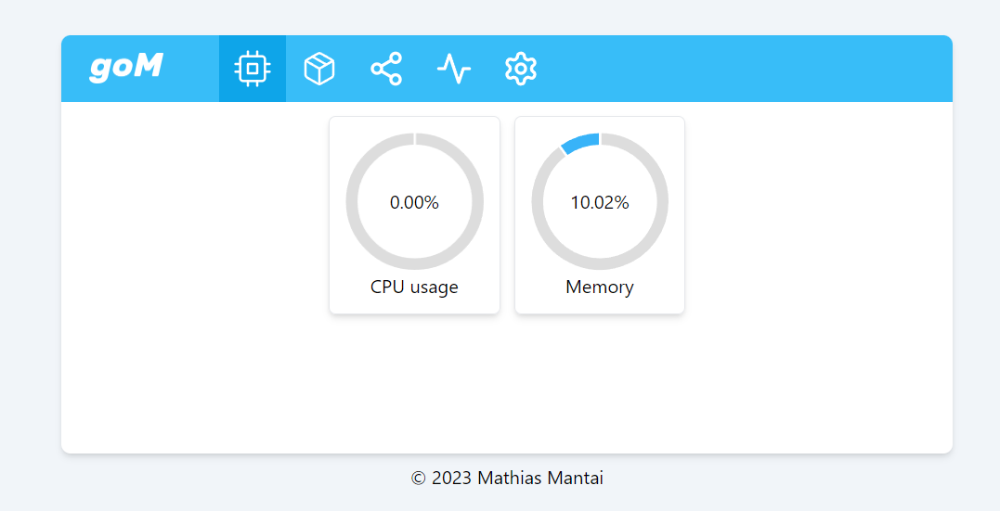

# goMonitoring

This is a web based monitoring tool for your linux server.

## Features
Currently goMonitoring supports the following
- Display information about your docker container (names, ids, status)
- Display cpu usage in semi realtime

## Planned features
- Start and Stop your docker container
- Display virtual memory usage
- Display information about your network interfaces
