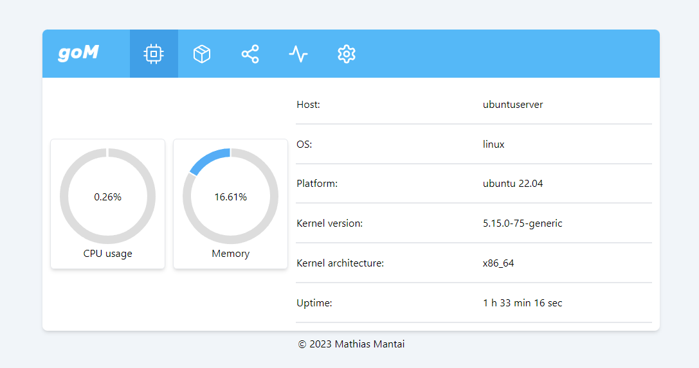
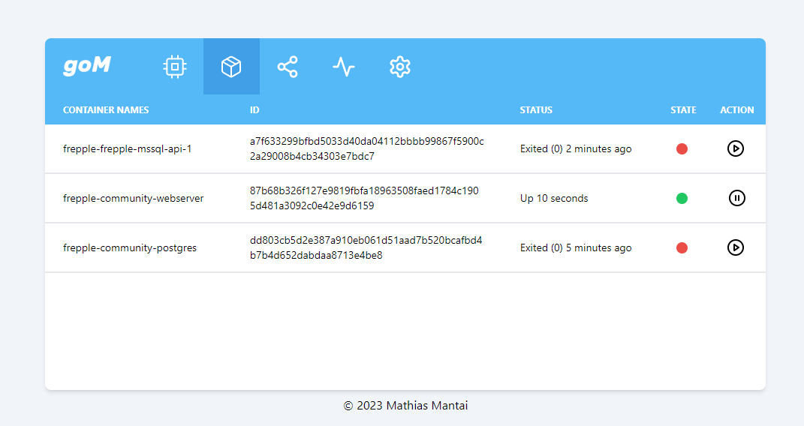

# goMonitoring

This is a web based monitoring tool for your linux server.

## Features
Currently goMonitoring supports the following
- Display information about your docker container (names, ids, status)
- Display cpu usage in semi realtime
- Display Memory
- Display general information about your system (host, os, system uptime, etc.)
- Start and Stop your docker container

## Planned features
- Display information about your network interfaces